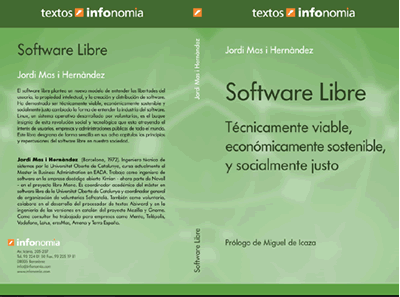

<b>Bienvenido a la web del libro:</b>
Software libre: t&eacute;cnicamente viable, ec&oacute;nomicamente
sostenible, socialmente justo 
 
 
<b>Sobre el libro</b> 
El software libre plantea un nuevo modelo de entender las libertades
del usuario, la propiedad intelectual, y la creaci&oacute;n y
distribuci&oacute;n de software. Ha demostrado ser t&eacute;cnicamente
viable, econ&oacute;micamente sostenible y socialmente justo cambiado
la forma de entender la industria del software. Linux, un sistema
operativo desarrollado por voluntarios, es el buque insignia de esta
revoluci&oacute;n social y tecnol&oacute;gica que esta atrayendo el
inter&eacute;s de usuarios, empresas y administraciones p&uacute;blicas
de todo el mundo. Este libro desgrana de forma sencilla en sus ocho
cap&iacute;tulos los principios y repercusiones del software libre en
nuestra sociedad. 
 
<b>Sobre el autor</b> 
Jordi Mas Hern&agrave;ndez (Barcelona, 1972). Ingeniero t&eacute;cnico
de sistemas por la Universitat Oberta de Catalunya, cursa actualmente
el Master in Business Administration en EADA. Trabaja como ingeniero de
software en la empresa dec&oacute;digo abierto Ximian - ahora parte de
Novell - en el proyecto libre Mono. Es coordinador acad&eacute;mico del
m&aacute;ster en software libre de la Universitat Oberta de Catalunya y
coordinador general de organizaci&oacute;n de voluntarios
Softcatal&agrave;. Tambi&eacute;n como voluntario, colabora en el
desarrollo del procesador de textos Abiword y en la ingenier&iacute;a
de las versiones en catal&aacute;n del proyecto Mozilla y Gnome. Como
consultor ha trabajado para empresas como Menta, Tel&eacute;polis,
Vodafone, Lotus, eresMas, Amena y Terra Espa&ntilde;a.  
 
<b>Licencia de la obra</b> 
Esta obra es libre y est&aacute; sometida a las condiciones de una
licencia Creative Commons. Puede redistribuir, copiar, y reutilizar y
mezclar este libro siempre que se haga con fines no comerciales y dando
cr&eacute;dito a su autor Jordi Mas i Hern&agrave;ndez .Para una copia
completa de la licencia visitar la web: <a
 href="http://creativecommons.org/licenses/by-nc/2.0">http://creativecommons.org/licenses/by-nc/2.0</a>.  
Version en PDF - <a href="llibrejmas.pdf">Descarga</a> (copia
exacta de la versi&oacute;n impresa) 
